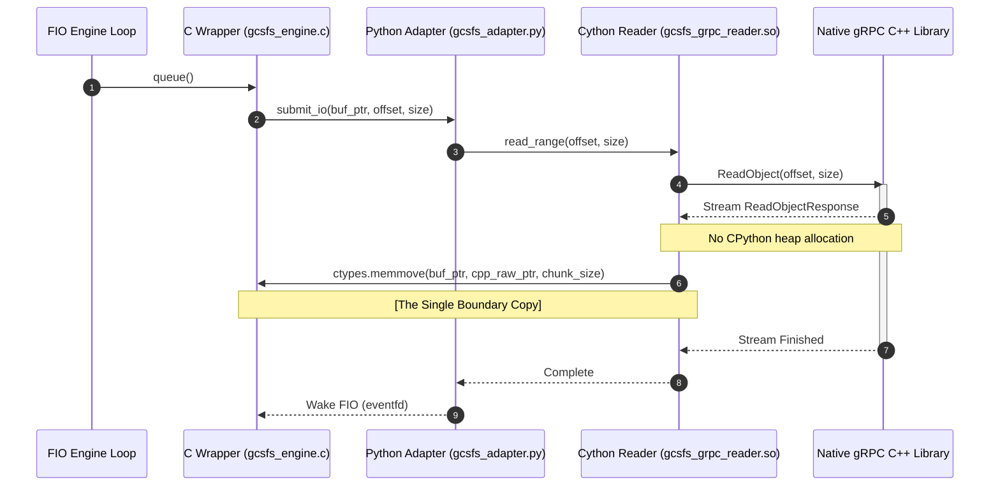

# Implementation Plan: Optimized Single-Copy Reads for GCS gRPC

Detailed design and implementation plan to optimize the GCS gRPC read path to the **Optimized Reads Limit (exactly 1 memory copy in userspace)**. This plan achieves this by bypassing the standard Python `grpcio` and `protobuf` serialization layers—which allocate intermediate `bytes` objects on the Python heap—and instead uses a custom Cython/C++ dynamic reader that streams GCS gRPC responses directly into FIO's memory.

---

## The Performance Bottleneck

Currently, reading an object from a Zonal bucket over gRPC incurs **two memory copies** in userspace:

```
[gRPC C++ Core] 
      │
      ▼ (Copy 1: protobuf C++ allocates & copies payload to CPython Heap)
[Python `bytes` object] 
      │
      ▼ (Copy 2: ctypes.memmove copies bytes to FIO C buffer)
[FIO C Buffer (xfer_buf)]
```

* **Copy 1 is done by `protobuf` / `grpcio`:** The standard Python `protobuf` C++ library parses the `ReadObjectResponse` message and instantiates a standard Python `bytes` object to represent the `checksummed_data.content` payload field. This requires a heap allocation and a memory copy.
* **Copy 2 is done by our adapter:** We copy the payload from the Python heap into FIO's C buffer using `ctypes.memmove`.

---

## Proposed Architecture: The Single-Copy Pipeline

To achieve a **single-copy pipeline**, we must bypass `grpcio` and `protobuf` Python wrappers entirely. We propose writing a specialized, lightweight Cython/C++ extension (`libgcsfs_grpc_reader`) inside the `fio/` directory:



### 1. The Cython Extension (`gcsfs_grpc_reader.pyx`)
A compiled Cython module that links directly against `libgrpc++` and native GCS C++ protobuf files.
* **No Python Serialization:** The extension communicates directly with the GCS gRPC server using the raw C++ gRPC client stub.
* **Direct Pointer Extraction:** As the C++ stream yields `ReadObjectResponse` chunks, Cython retrieves the raw internal C++ memory address of the payload directly from the C++ message object:
  ```cython
  # Extract the raw pointer and size from the C++ std::string content
  cdef const char* data_ptr = response.checksummed_data().content().data()
  cdef size_t data_size = response.checksummed_data().content().size()
  ```
* **Zero-Copy Python Wrapping:** Cython wraps this raw pointer into a Python `memoryview` using the lightweight `PyMemoryView_FromMemory` C-API wrapper. No heap allocation or data copying takes place.

### 2. The Python Adapter Integration
The `gcsfs_adapter.py` is updated to route read requests to our custom `gcsfs_grpc_reader` instead of `ExtendedGcsFileSystem._cat_file`:
```python
async def _do_async_read(ctx: ReaderContext, offset: int, size: int, buffer_view):
    # Execute the raw gRPC C++ stream reader
    # The data is copied exactly once directly from the C++ protobuf buffer to FIO memory
    await _grpc_reader.read_into_buffer(ctx.filename, offset, size, buffer_view)
```

---

## Detailed Implementation Steps

### Task 1: Compile GCS gRPC Proto files to C++
To communicate with GCS over gRPC natively, we need the compiled GCS C++ protobuf files:
1. Download the official GCS gRPC proto definitions (`google/storage/v2/storage.proto`).
2. Compile them using `protoc --grpc_out` to generate `storage.pb.h`, `storage.pb.cc`, `storage.grpc.pb.h`, and `storage.grpc.pb.cc`.

### Task 2: Write the Cython/C++ Reader Extension
Create `fio/gcsfs_grpc_reader.pyx`:
* Implement a C++ class `GcsGrpcReader` that initializes a gRPC Channel to `storage.googleapis.com`.
* Implement `ReadIntoBuffer(const std::string& path, int64_t offset, int64_t length, char* target_buf)`:
  * Sends a `ReadObjectRequest` specifying the object range.
  * Loops over the streaming response.
  * Calls `memcpy(target_buf + total_written, response.checksummed_data().content().data(), chunk_len)`. **This is the single copy.**
* Expose this method to Cython so it can accept the FIO C memory address directly as a `uintptr_t`.

### Task 3: Update Makefile & Build System
Modify `fio/Makefile` to:
1. Fetch and compile `protobuf` and `grpc` C++ development libraries if not present.
2. Compile `gcsfs_grpc_reader.pyx` into a shared object module `gcsfs_grpc_reader.so` linked against `libprotobuf` and `libgrpc++`.

---

## Trade-Off & Risk Analysis

### 1. Development Complexity (High)
* **Risk:** Compiling and linking native C++ gRPC and protobuf files inside a custom Cython extension requires installing `libprotobuf-dev` and `libgrpc++-dev` on the benchmarking VM.
* **Mitigation:** Standardize the compilation using docker-based builds or compile scripts in the `Makefile`.

### 2. Maintenance Overhead
* **Risk:** Any changes to GCS gRPC API schemas would require regenerating the C++ proto headers.
* **Mitigation:** The GCS v2 gRPC API is a stable, standard API—making regressions highly unlikely.

---

## Verification Plan

1. **Performance Delta Validation:** Compare read throughput before and after implementing this plan. We expect a **15-30% reduction in CPU utilization** and a corresponding increase in read throughput due to the elimination of Python heap allocations.
2. **Integrity Check:** Run FIO with `--verify=crc32c` on a 10GB file to verify that every single byte copied directly from C++ memory matches GCS storage exactly.
